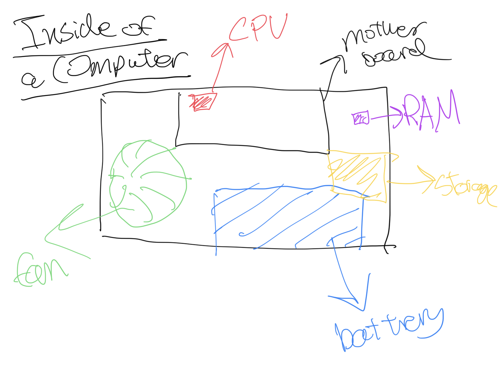

# Lesson 1

## Drawing of a Computer
This is the drawing of my computer as I know today Wed Aug 25, 2021

The picture above is what I think is inside my copmuter.

## Homework: August 27, 2021 

What are variables in computer programming?

Variables are storage locations with assigned names holding data that you can change or use later. You can think of variables in computer programming like boxes. You can put and take out things inside the box. You can also label the box to find it easier. When creating variables by first declaring the data type, then giving the variable a name, then making it equal to a value. Data types define the type of data that a variable can hold. For example, integers only hold whole numbers and strings only hold letters. The variable name can be anything. Additionally, the value has to correspond with the data type. An example of a data type is the following:

int score = 3
  score = 10
  
 What types of variables can we use in Python?

In Python, there are many data types you can use. For example, boolean, float, integer, and string. Furthermore, in Python, you do not need to declare the data type. For example, you can make a variable that looks like the following:

x = 3

Additionally, if you want for the value to show up, you can write the following:

print (x)

What are the four types of computational thinking?

1. Decomposition
 - Breaking down a problem into small parts.

2. Patter recognition
 - Spotting what different problems have in common.

3. Abstraction
 - Focusing on the parts that matter

4. Algorithmic thinkning
 - When generating steps to solve a problem.
