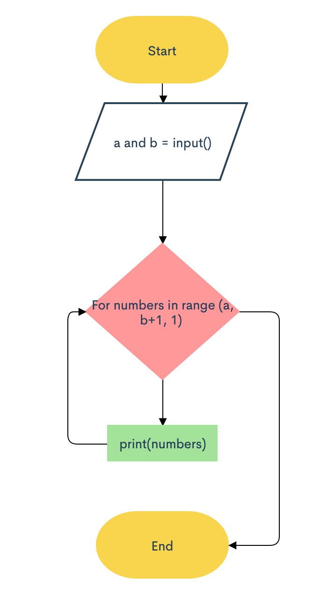
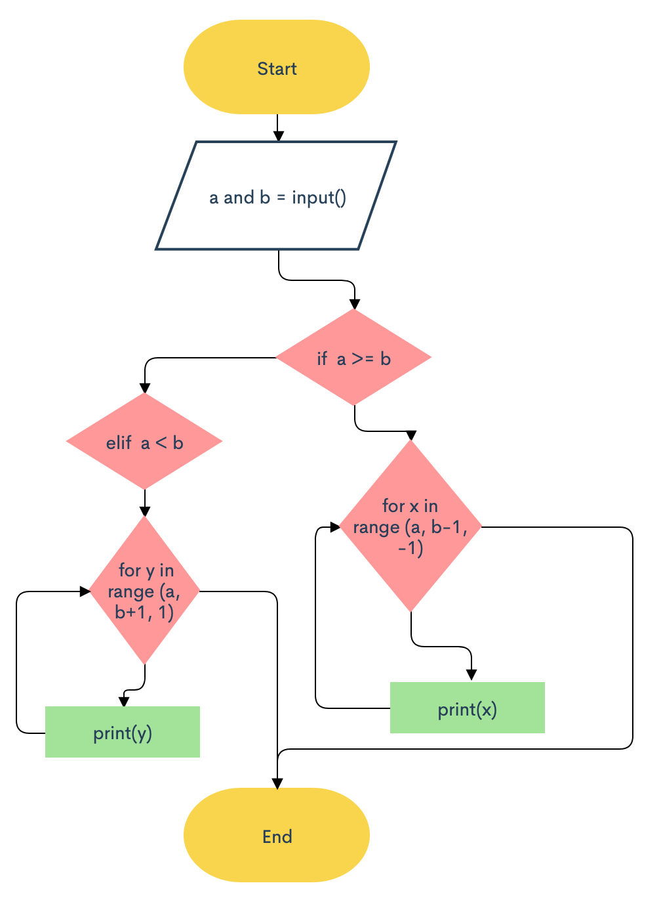
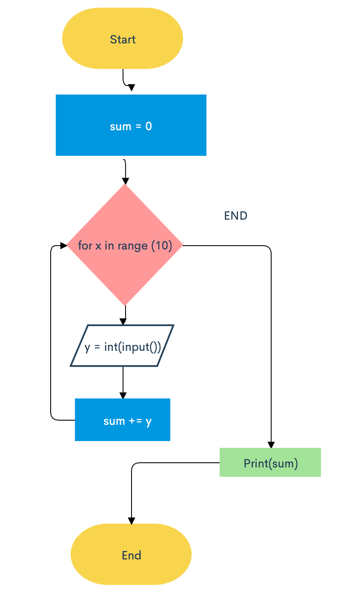
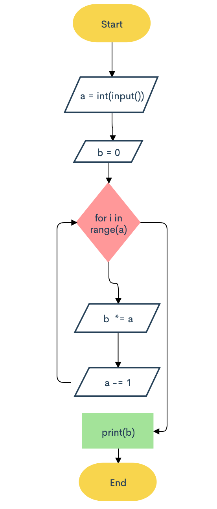
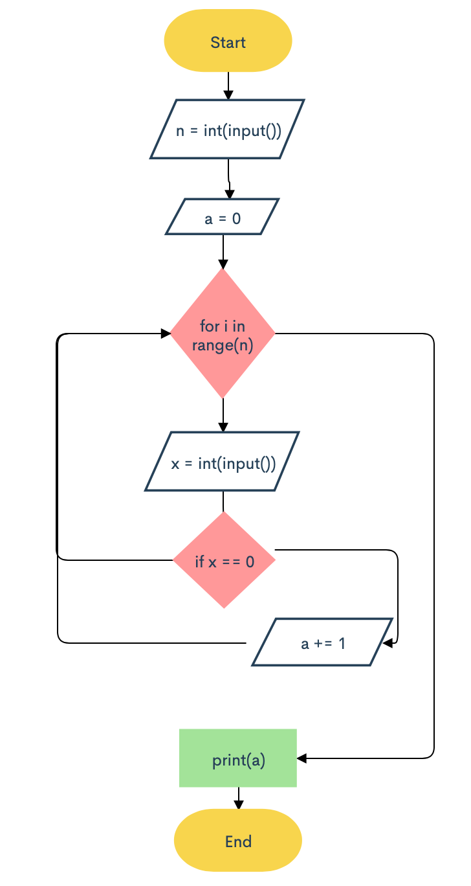
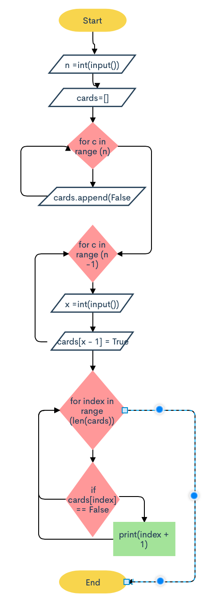

## Series-1
### Given two integers A and B (A ≤ B). Print all numbers from A to B inclusively.
```.py
a = int(input("please input the first value"))
b = int(input("please input the second value"))
for numbers in range(a, b + 1, 1):
    print(numbers)
```

## Series-2
### Given two integers A and B. Print all numbers from A to B inclusively, in ascending order, if A < B, or in descending order, if A ≥ B.
```.py
a = int(input("please input the first value"))
b = int(input("please input the second value"))
if a >= b: 
    for x in range (a, b-1, -1):
        print(x)
elif a < b: 
    for y in range (a, b+1, 1):
        print(y)
```

## Sum of Ten Numbers
### 10 numbers are given in the input. Read them and print their sum. Use as few variables as you can.
```.py
sum = 0
for x in range (10):
    y = int(input())
    sum += y
print(sum)
```

## Sum of N Numbers
### N numbers are given in the input. Read them and print their sum. The first line of input contains the integer N, which is the number of integers to follow. Each of the next N lines contains one integer. Print the sum of these N integers.
```.py
n = int(input())
x = 0
for i in range(n):
    x += int(input())
print(x)
```

## Sum of Cubes
### For the given integer N calculate the following sum: 1^3+2^3+…+N^3
```.py
n = int(input())
y = 0
for i in range(n+1):
    x  = i**3
    y += x
print(y)
```

## Factorial
### In mathematics, the factorial of an integer n, denoted by n! is the following product: n!=1×2×…×n. For the given integer n, calculate the value n. Don't use math module in this exercise.
```.py
a = int(input())
b = 1
for i in range(a):
    b *= a
    a -= 1
print(b)
```

## The Numbers of Zeros
### Given N numbers: the first number in the input is N, after that N integers are given. Count the number of zeros among the given integers and print it. You need to count the number of numbers that are equal to zero, not the number of zero digits.
```.py
n = int(input())
a = 0
for i in range (n):
    x = int(input())
    if x == 0:
        a += 1
print(a)
```

## Adding Factorials
### Given an integer n, print the sum 1!+2!+3!+...+n!.
```.py
num = int(input())
a = 1
b = 0
for i in range (1, num+1):
    a *= i
    b += a
print(b)
```

## Ladder
### For given integer n ≤ 9 print a ladder of n steps. The k-th step consists of the integers from 1 to k without spaces between them.
```.py
n = int(input())
for i in range(1, n+1):
    if i == 1:
        print(1, sep='', end='                  ')
    elif i == 2:
        print(1,2, sep='', end='                  ')
    elif i == 3:
        print(1,2,3, sep='', end='                  ')
    elif i == 4:
        print(1,2,3,4, sep='', end='                  ')
    elif i == 5:
        print(1,2,3,4,5, sep='', end='                  ')
    elif i == 6:
        print(1,2,3,4,5,6, sep='', end='                  ')
    elif i == 7:
        print(1,2,3,4,5,6,7, sep='', end='                  ')
    elif i == 8:
        print(1,2,3,4,5,6,7,8, sep='', end='                  ')
    elif i == 9:
        print(1,2,3,4,5,6,7,8,9, sep='', end='                  ')
```

## Lost card
### There was a set of cards with numbers from 1 to N. One of the card is now lost. Determine the number on that lost card given the numbers for the remaining cards.Given a number N, followed by N − 1 integers - representing the numbers on the remaining cards (distinct integers in the range from 1 to N). Find and print the number on the lost card.
```.py
n = int(input("Enter size of deck: "))
cards = []
for c in range (n):
  cards.append(False)
for c in range (n -1):
  x = int(input("Enter the card number: "))
  cards[x - 1] = True
for index in range (len(cards)):
  if cards[index] == False:
    print(index + 1)
```
 
