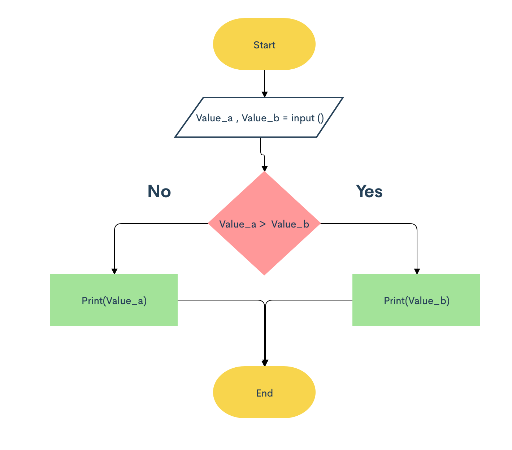
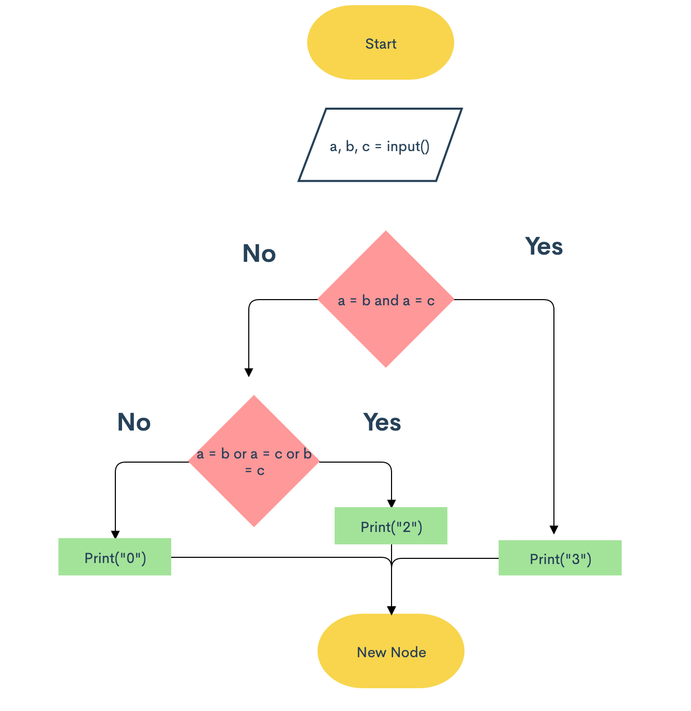
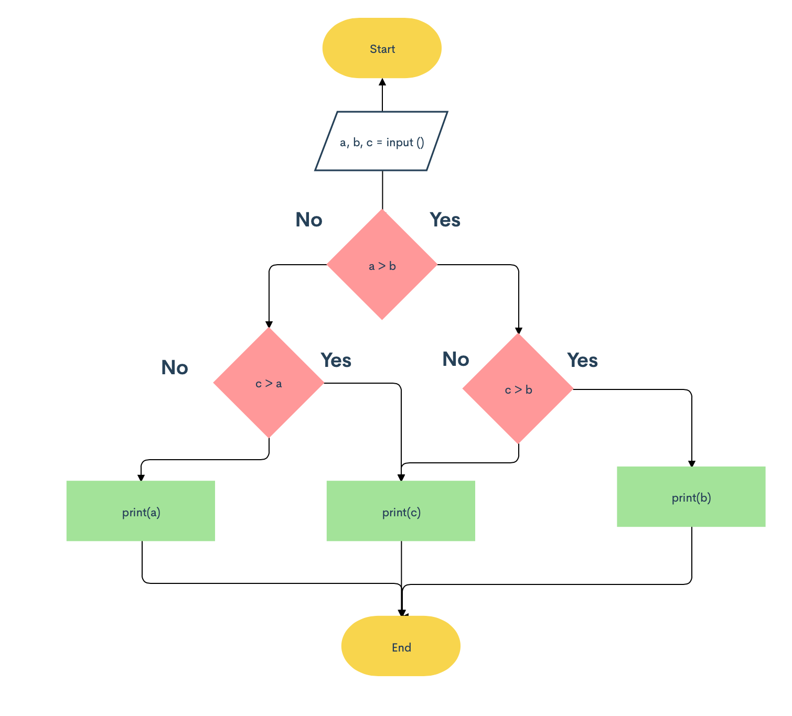
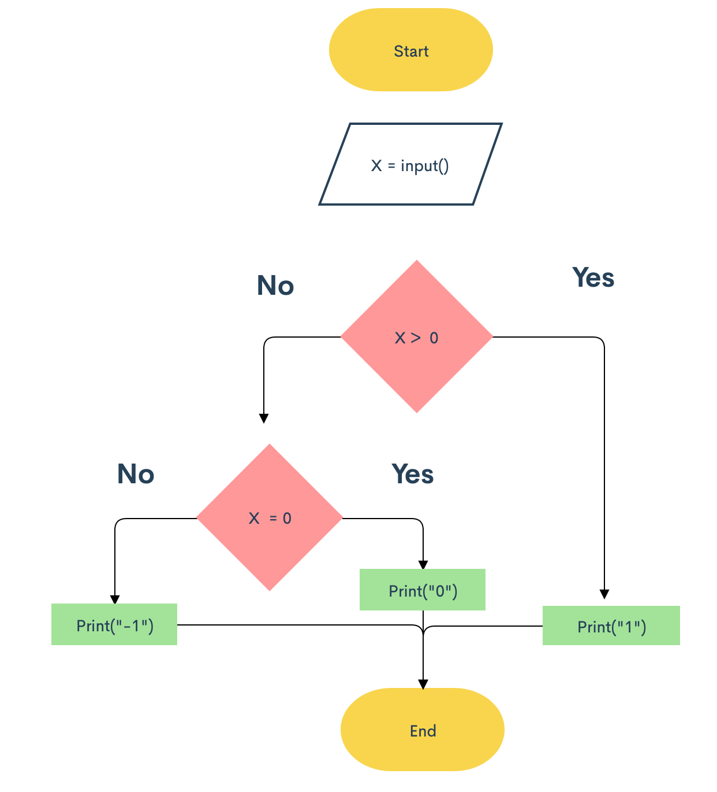
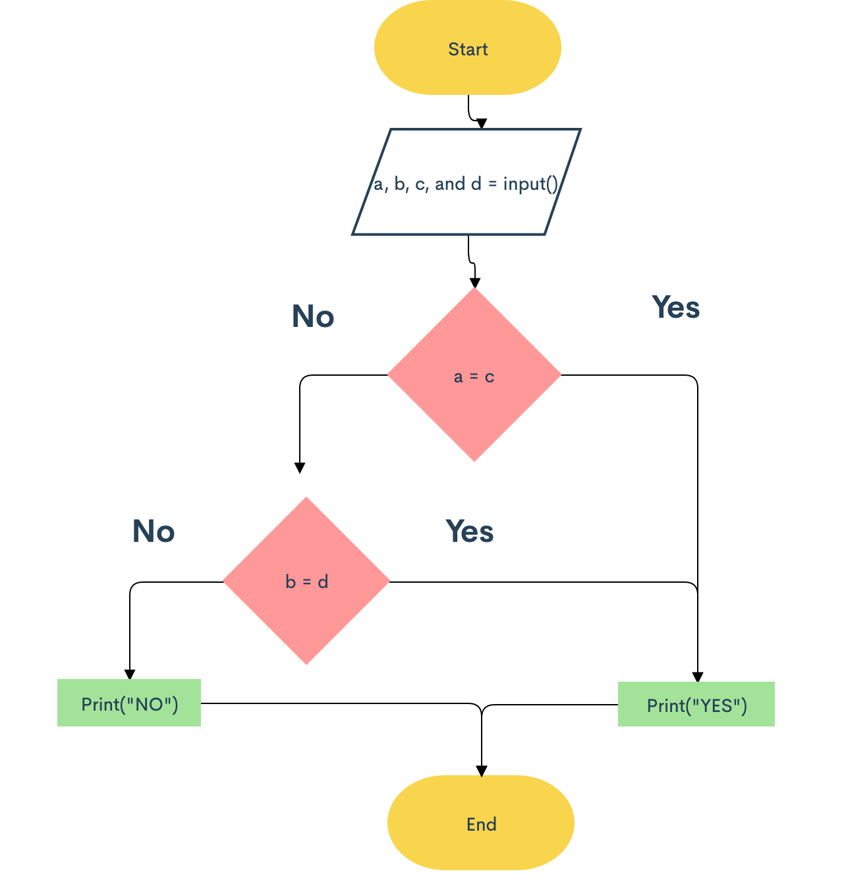
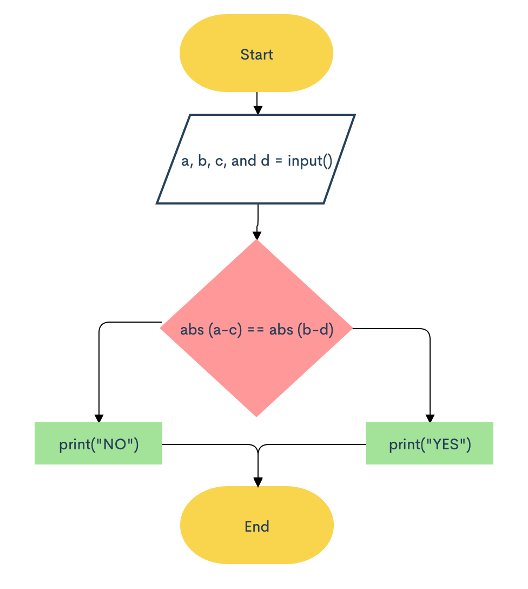
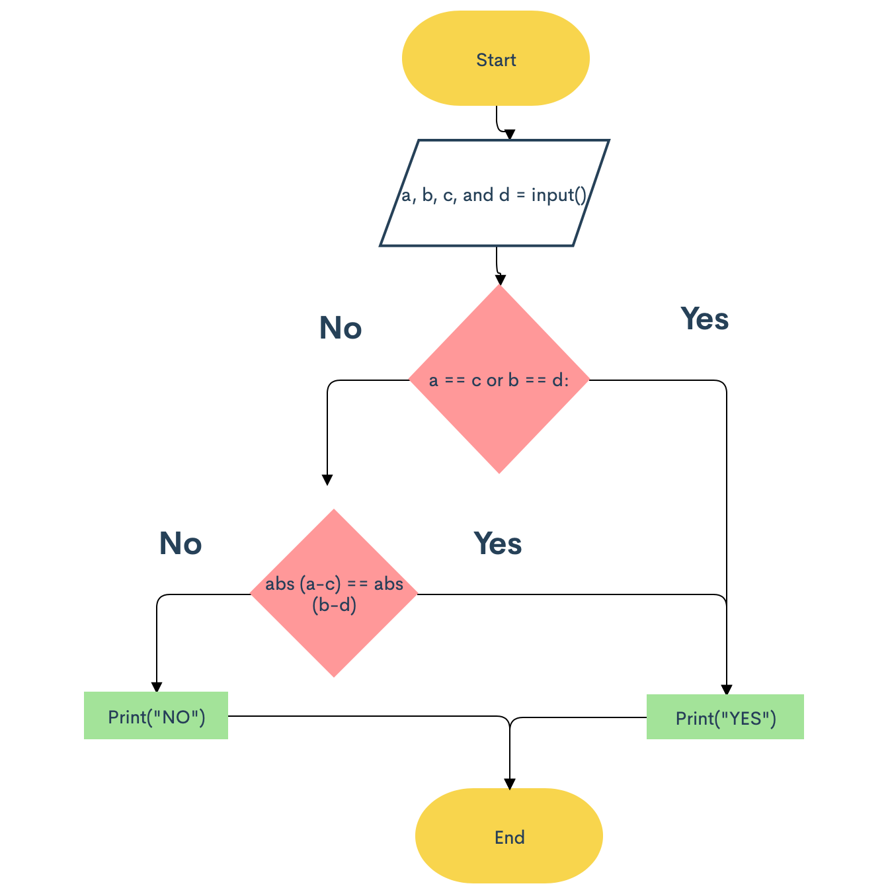
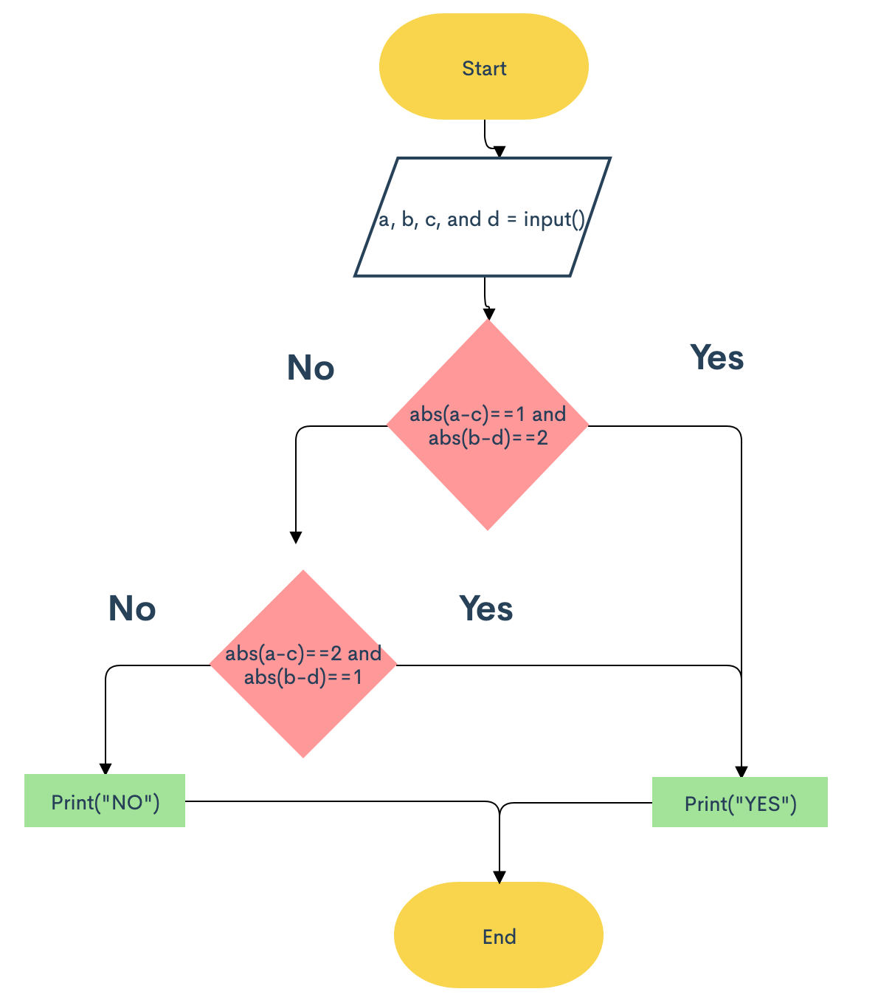
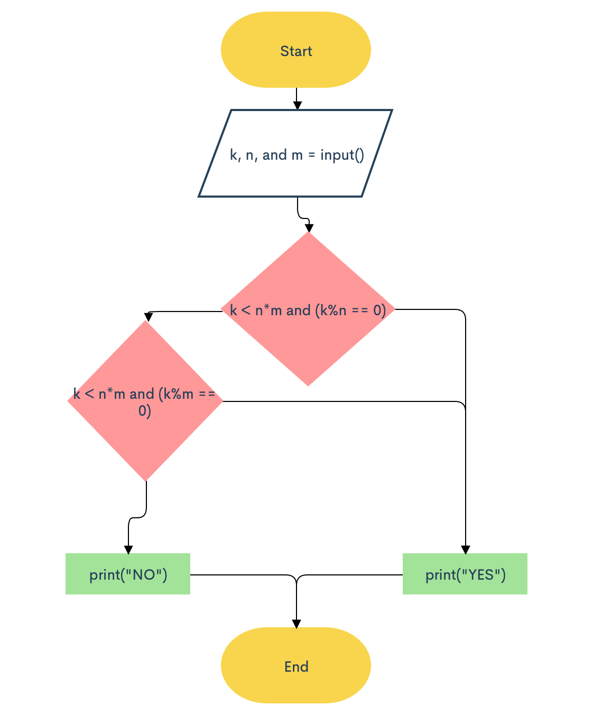

## Minimum of Two Numbers
### Given two integers, print the smaller value.
```.py
Value_a = int(input("please input the value of 'a'"))
Value_b = int(input("please input the value of 'b'"))
if Value_a < Value_b:
    print(Value_a)
else:
    print(Value_b)
``` 
   
## Sign Function
### For the given integer X print 1 if it's positive, -1 if it's negative, or 0 if it's equal to zero.
```.py
X = int(input("please enter the value for 'X' "))
if X > 0:
    print("1")
elif X == 0:
    print("0")
else: 
    print("-1")    
```
     
## Minimum of three numbers
### Given three integers, print the smallest value.
```.py
Value_a = int(input("please input the value of 'a'"))
Value_b = int(input("please input the value of 'b'"))
Value_c = int(input("please input the value of 'c'"))
if Value_a > Value_b and Value_c > Value_b:
    print(Value_b)
if Value_b > Value_a and Value_c > Value_a:
    print(Value_a)
if Value_a > Value_c and Value_b > Value_c:
    print(Value_c)
```    
      
## Equal Numbers
### Given three integers, determine how many of them are equal to each other. The program must print one of these numbers: 3 (if all are the same), 2 (if two of them are equal to each other and the third is different) or 0 (if all numbers are different).
```.py
Value_a = int(input("please input the value of 'a'"))
Value_b = int(input("please input the value of 'b'"))
Value_c = int(input("please input the value of 'c'"))
if Value_a == Value_c and Value_c == Value_b:
    print("3")
elif Value_a == Value_b or Value_a == Value_c or Value_b == Value_c:
    print("2")
else:
    print("0")
```  
       
## Rook Move
### Chess rook moves horizontally or vertically. Given two different cells of the chessboard, determine whether a rook can go from the first cell to the second in one move. The program receives the input of four numbers from 1 to 8, each specifying the column and row number, first two - for the first cell, and then the last two - for the second cell. The program should output YES if a rook can go from the first cell to the second in one move, or NO otherwise.
```.py
a = int(input("Please input the value of 'a'"))
b = int(input("Please input the value of 'b'"))
c = int(input("Please input the value of 'c'"))
d = int(input("Please input the value of 'd'"))
if a == c or b == d:
    print("YES")
else:
    print("NO")
```
     
## Chess board: same color
### Given two cells of a chessboard. If they are painted in one color, print the word YES, and if in a different color - NO. The program receives the input of four numbers from 1 to 8, each specifying the column and row number, first two - for the first cell, and then the last two - for the second cell.
```.py
a = int(input("Please input the value of 'a'"))
b = int(input("Please input the value of 'b'"))
c = int(input("Please input the value of 'c'"))
d = int(input("Please input the value of 'd'"))
if (a + b) %2 == 0 and (c + d) %2 == 0:
    print("YES")
elif (a + b) %2 != 0 and (c + d) %2 != 0:
    print("YES")
else:
    print("NO")
```
     
## Chess board: King move
### The program receives the input of four numbers from 1 to 8, each specifying the column and row number, first two - for the first cell, and then the last two - for the second cell. The program should output YES if a king can go from the first cell to the second in one move, or NO otherwise.
```.py
a = int(input("Please input the value of 'a'"))
b = int(input("Please input the value of 'b'"))
c = int(input("Please input the value of 'c'"))
d = int(input("Please input the value of 'c'"))
if -1<=(a-c)<=1 and -1<=(b-d)<=1:
    print("YES")
else:
    print("NO")
```
     
## Chess board: Bishop's move
### The program receives as input four numbers from 1 to 8, specifying the column and row numbers of the starting square and the column and row numbers of the ending square. The program should output YES if a Bishop can go from the first square to the second in one move, or NO otherwise.
```.py
a = int(input("Please input the value of 'a'"))
b = int(input("Please input the value of 'b'"))
c = int(input("Please input the value of 'c'"))
d = int(input("Please input the value of 'c'"))
if abs (a-c) == abs (b-d):
    print("YES")
else:
    print("NO")
```
     
## Chess board: Queen's move
### The program receives the input of four numbers from 1 to 8, each specifying the column and row number, first two - for the first cell, and then the last two - for the second cell. The program should output YES if a queen can go from the first cell to the second in one move, or NO otherwise.
```.py
a = int(input("Please input the value of 'a'"))
b = int(input("Please input the value of 'b'"))
c = int(input("Please input the value of 'c'"))
d = int(input("Please input the value of 'd'"))
if a == c or b == d:
    print("YES")
elif abs (a-c) == abs (b-d):
    print("YES")
else:
    print("NO")
```
     
## Chess board: Knight's move
### The program receives the input of four numbers from 1 to 8, each specifying the column and row number, first two - for the first cell, and then the last two - for the second cell. The program should output YES if a knight can go from the first cell to the second in one move, or NO otherwise.
```.py
a = int(input("Please input the value of 'a'"))
b = int(input("Please input the value of 'b'"))
c = int(input("Please input the value of 'c'"))
d = int(input("Please input the value of 'd'"))
if abs(a-c)==1 and abs(b-d)==2 or abs(a-c)==2 and abs(b-d)==1:
    print("YES")
else:
    print("NO")
```
     
## Chocolate bar
### Chocolate bar has the form of a rectangle divided into n×m portions. Chocolate bar can be split into two rectangular parts by breaking it along a selected straight line on its pattern. Determine whether it is possible to split it so that one of the parts will have exactly k squares.
The program reads three integers: n, m, and k. It should print YES or NO.
```.py
n = int(input("Please input the value of 'n'"))
m = int(input("Please input the value of 'm'"))
k = int(input("Please input the value of 'k'"))
if k < n*m and ((k%n == 0) or (k%m == 0)):
    print("YES")
else:
    print("NO")
```
     
## Leap Year
### Given the year number. You need to check if this year is a leap year. If it is, print LEAP, otherwise print COMMON.
```.py
year = int(input("please input the year"))
if year%4 == 0 and year%100 != 0 or year%400 == 0:
    print("LEAP")
else:
    print("COMMON")
```
     
